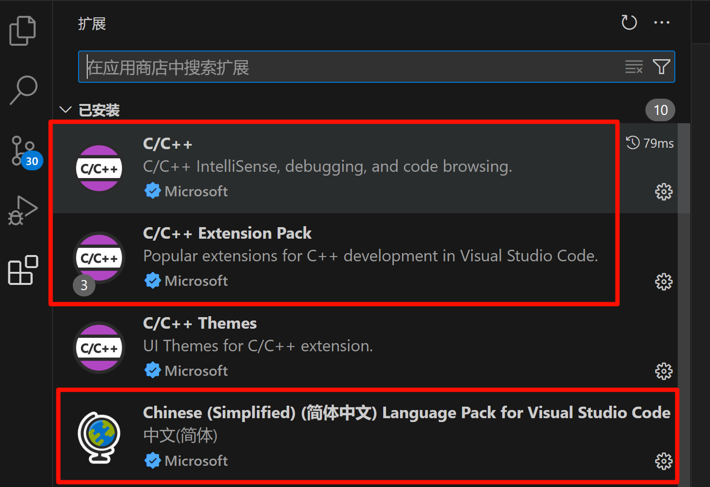
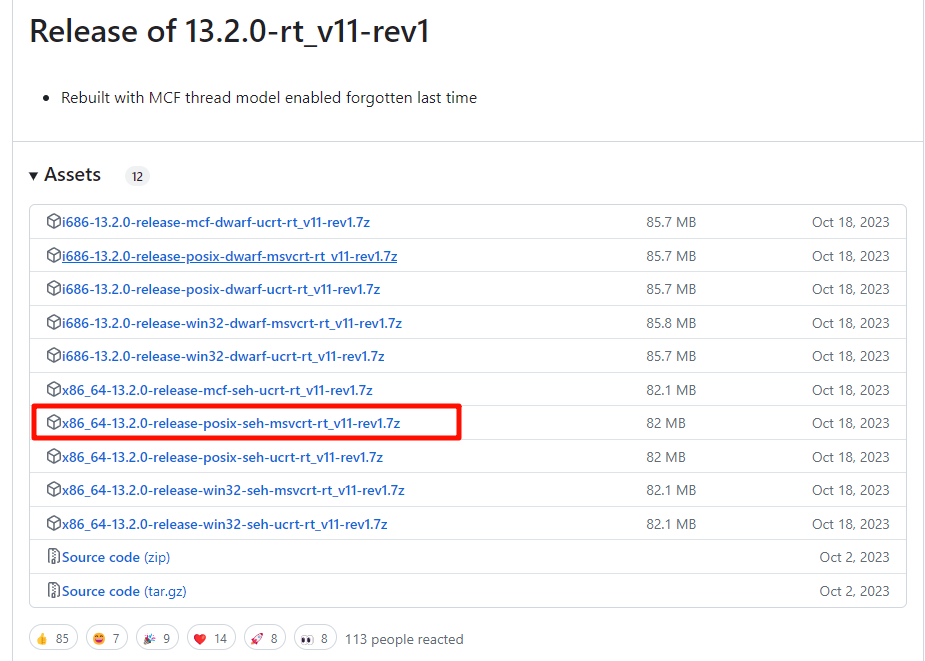
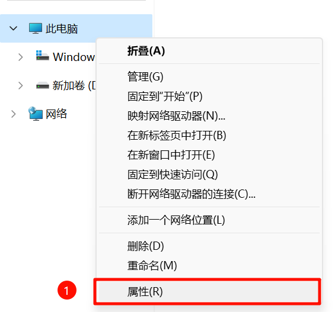
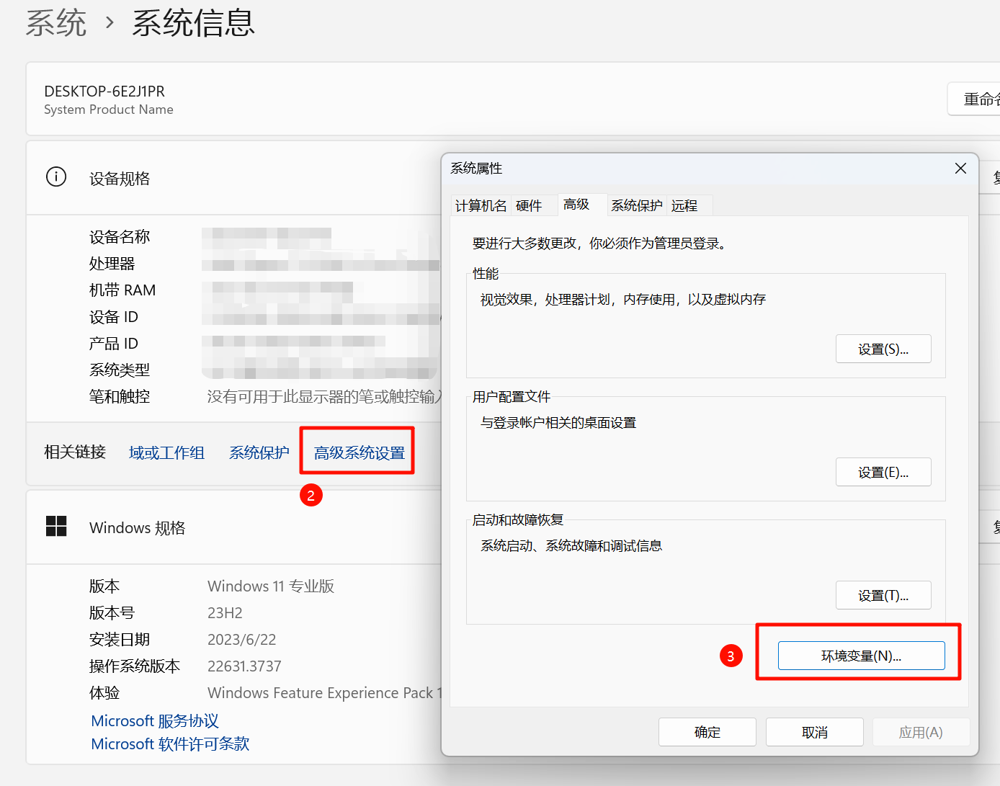
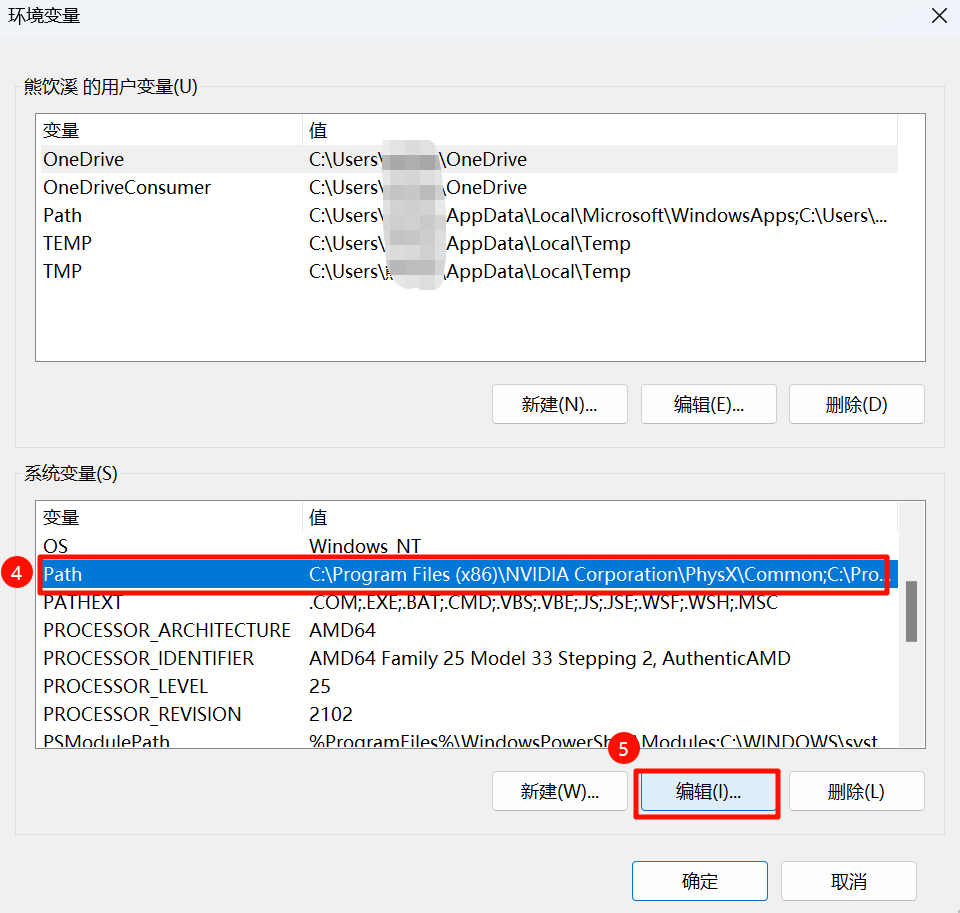
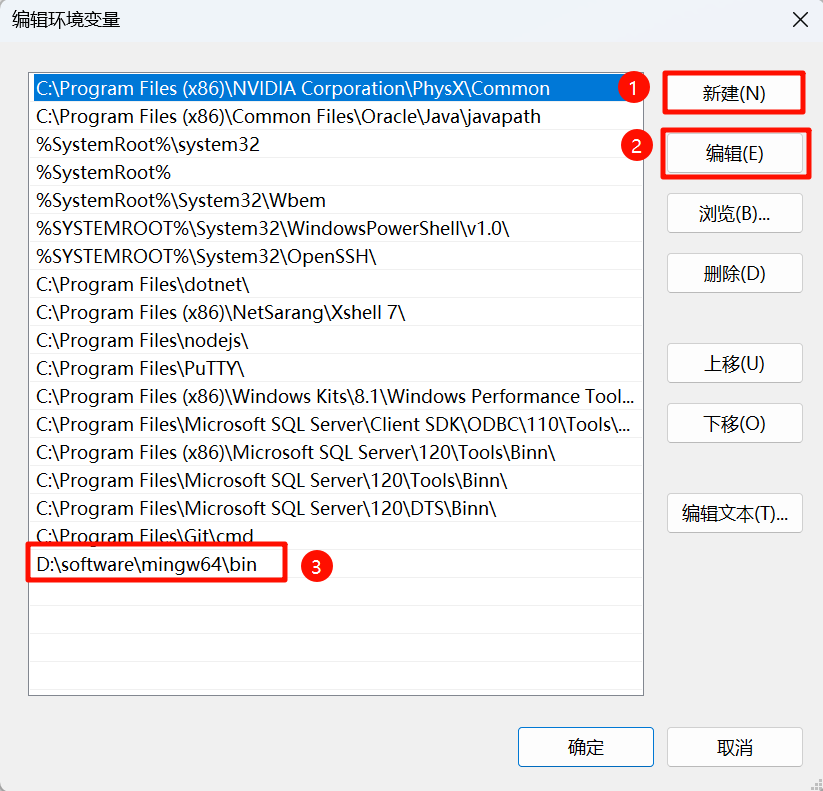
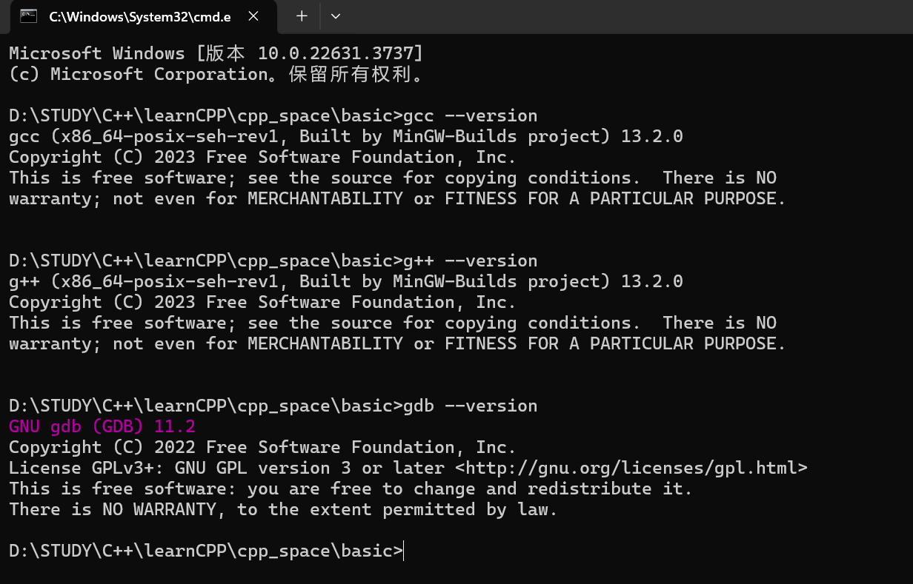
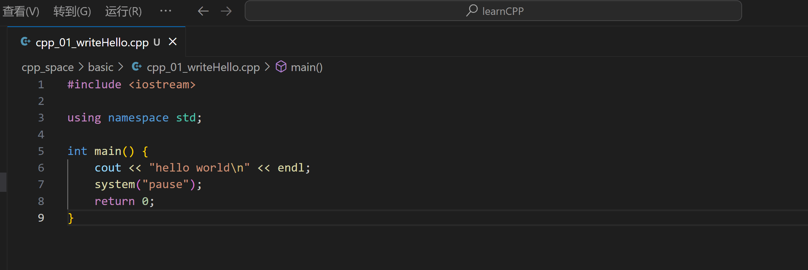
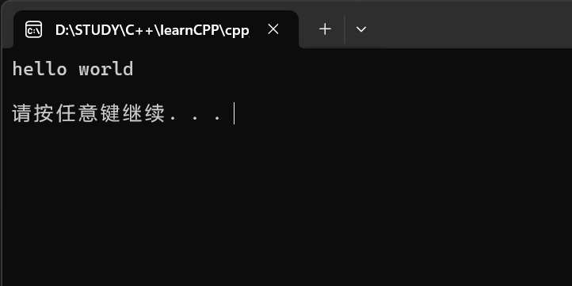

# cpp_space
学习C++ 的笔记
## 1. 环境准备
1. 下载vscode，并下载这几个插件


2. 下载MinGW-w64
[MinGW-w64官网](https://www.mingw-w64.org/downloads/)
[github](https://github.com/niXman/mingw-builds-binaries/releases)

本文使用在github上下载二进制文件的方法。

下载完成后解压到电脑中，**路径必须不含有中文**，包括vscode项目也不能含有中文

3. 配置环境变量




将下载后解压的文件夹中的bin文件添加进环境变量中即可。
**配置完成后一定要一步一步的点确定**
验证是否安装成功可以使用cmd输入：
```shell
g++ --version
gcc --version
gdb --version
```


## 4. 调试代码

点击运行任务后在当前目录下会生成.exe的可执行文件，在文件管理器中执行即可。
